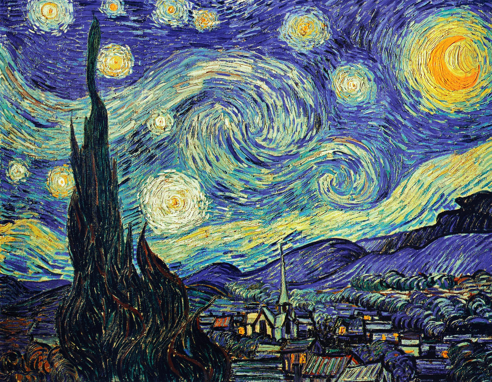
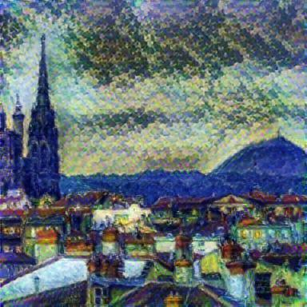

# Art Generator

Simple style transfer using a [TensorFlow Style Transfer Model](https://tfhub.dev/sayakpaul/lite-model/arbitrary-image-stylization-inceptionv3/dr/predict/1).   

## Exemple :
**Content image** :   

**Style image** :     

**Output** :     
